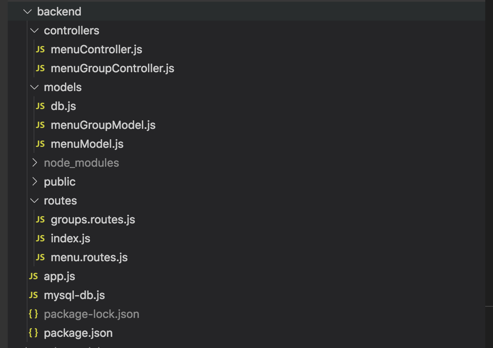

# 서버 폴더 구조

routes에 UI에서 직접적으로 호출할 수 있는 post, get, put, delete 를 선언. 테이블 별로 새 파일을 구성. 필요 테이블에 따라 앞으로 차차 늘릴 예정. 

Controller에서는 실제적으로 query를 호출할 수 있도록 실제 서버 통신을 기록. Controller도 마찬가지로 각 routes 갯수만큼 늘릴 예정. 이유는 가독성이 좋은 소스는 눈에 잘 들어와야 한다고 생각하기 떄문.

models에는 실제 query 가 들어있음.  models도 마찬가지로 각 routes 갯수만큼 늘릴 예정. 이유 역시 Controller를 늘리는 것과 같은 이유.

